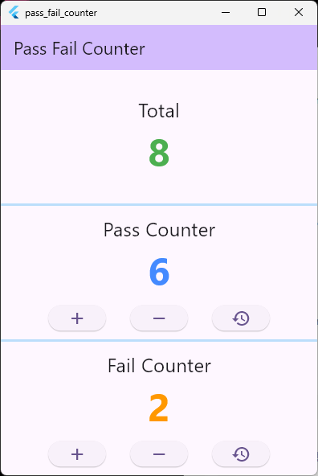

# pass_fail_counter

Pass, fail, total counter

## Getting Started

There are three screen block, total/pass/fail.
This code uses getx to notify value change.

## History

- Basic feature works with GetX

## TODO

- Apply Riverpod
- Add REC button with scrollable view to see history
